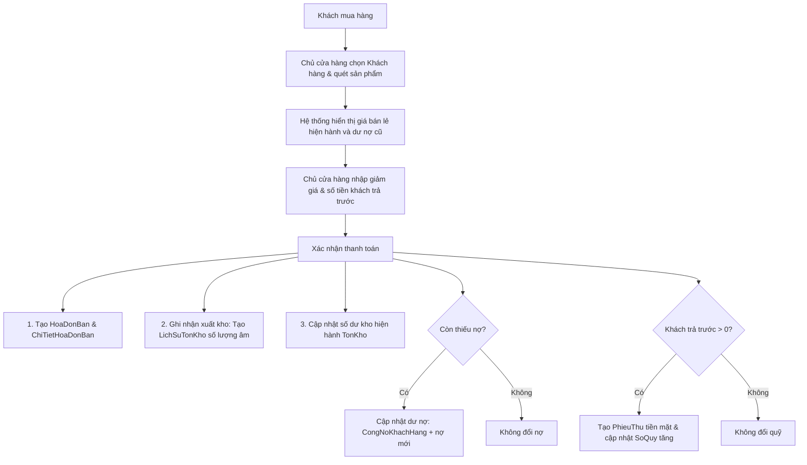

# TÀI LIỆU 06: QUY TRÌNH NGHIỆP VỤ HỆ THỐNG
## LUỒNG VẬN HÀNH CHUẨN CỦA CỬA HÀNG VẬT TƯ NÔNG NGHIỆP

Tài liệu này mô tả các luồng nghiệp vụ cốt lõi, thể hiện cách các bảng cơ sở dữ liệu kết hợp chặt chẽ để đảm bảo số liệu chính xác tuyệt đối.

---

### 1. Quy trình Bán hàng gối đầu và Ghi nhận Công nợ (Sales & Debt Flow)
Nghiệp vụ bán hàng là luồng quan trọng nhất, diễn ra liên tục tại quầy.

- **Ví dụ cụ thể:**
  - Nông dân Nguyễn Văn A mua 10 chai thuốc trừ bệnh Anvil, tổng trị giá `850,000đ`.
  - Ông A chỉ trả trước `200,000đ`, còn lại nợ `650,000đ` gối vụ.
  - Hệ thống tự động:
    1. Trừ tồn kho 10 chai Anvil trong bảng `TonKho` và ghi log `LichSuTonKho`.
    2. Cộng thêm `650,000đ` vào tổng nợ của ông A trong `CongNoKhachHang`.
    3. Tạo `PhieuThu` trị giá `200,000đ` tăng quỹ trong `SoQuy`.

---

### 2. Quy trình Nhập hàng và Quản lý Lịch sử Kho (Inventory Logging Flow)
Mọi phát sinh tăng giảm kho phải được chứng minh để tránh lệch kho hoặc thất thoát tài chính.

- **Khi Nhập kho:** Số lượng nhập được cộng vào bảng tồn kho trung tâm `TonKho` đồng thời ghi rõ loại giao dịch là `NhapHang` kèm tham chiếu mã phiếu nhập trong bảng `LichSuTonKho`.
- **Khi Kiểm kho:** Nếu phát hiện sai lệch thực tế và phần mềm, chủ cửa hàng nhập số lượng thực tế kiểm đếm. Hệ thống tự động tính toán khoản chênh lệch (ví dụ: thực tế hụt 2 chai) và ghi nhận bản ghi `LichSuTonKho` với số lượng thay đổi là `-2.00` kèm ghi chú "Kiem kho - Hao hut thuc te".

---

### 3. Quy trình Đọc bao bì bằng AI OCR (AI-Powered Camera Scanning)
Quy trình đơn giản hóa đăng ký hàng hóa mới thông qua trí tuệ nhân tạo:

1. **Chụp ảnh:** Chủ cửa hàng đặt chai thuốc bảo vệ thực vật trước camera, chụp mặt trước chứa tên thương hiệu và mặt sau chứa hoạt chất, cách dùng.
2. **Gửi lên server:** Giao diện mã hóa ảnh dưới dạng chuỗi base64 và gửi lên endpoint `/api/v1/ai/ocr`.
3. **Phân tích bằng Gemini:**
   - Server gọi mô hình `gemini-3.6-flash` với cấu hình yêu cầu trả về schema JSON chuẩn.
   - AI đọc toàn bộ chữ trên bao bì (`NoiDungOCR`), bóc tách chính xác tên thương mại, hoạt chất chính, hàm lượng, dung tích/quy cách và các sâu bệnh cần đặc trị.
4. **Hiển thị & Xác nhận:** Giao diện nhận kết quả JSON cấu trúc và tự động điền (autofill) vào các trường nhập liệu tương ứng. Chủ cửa hàng chỉ cần kiểm tra nhanh bằng mắt, sửa lại nếu cần và ấn **Lưu lại** để tạo sản phẩm chính thức vào database.
